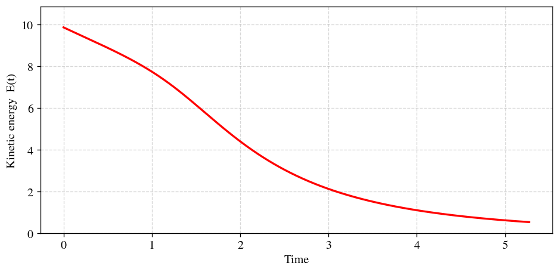
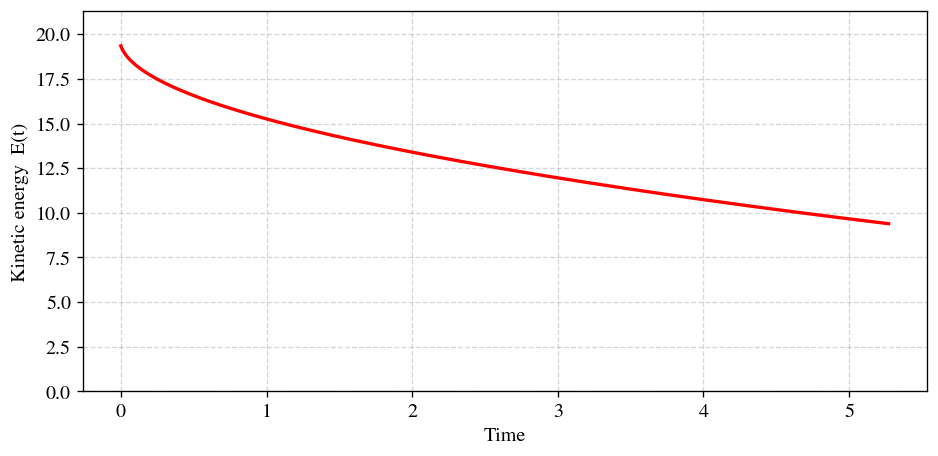
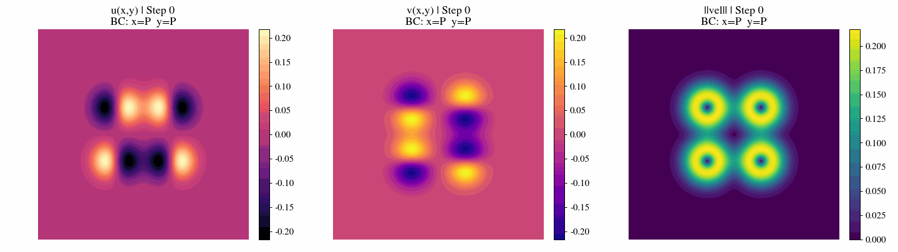
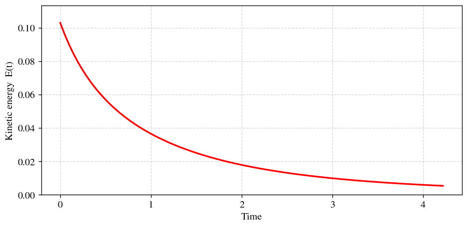
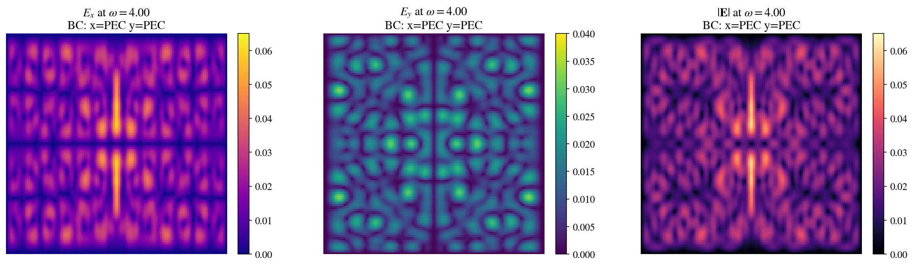
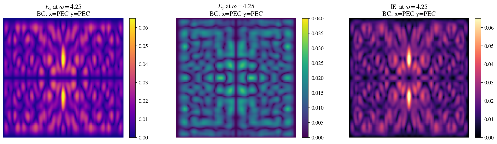
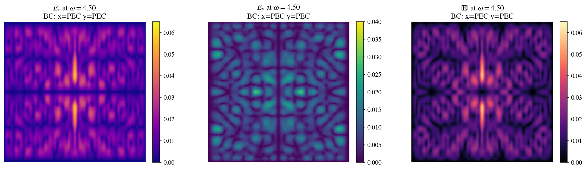

# AD vs. FD JFNK Solver
A optimized, fully implicit solver for non-linear PDEs a Jacobian-Free Newton-Krylov (JFNK) method, using Automatic Differentiation (AD) from JAX and Finite Differences (FD) for Jacobian-vector products.

# Burgers' equation

$$
\frac{\partial \mathcal{U}}{\partial t} + (\mathcal{U} \cdot \nabla)\mathcal{U} = \nu \nabla^2 \mathcal{U}
$$

Where $\mathcal{U} = (u, v)$ is the velocity field, and $\nu$ is the kinematic viscosity.

**Key Features:**
* Combines JIT-compiled JAX math with Optimized GMRES solvers (SciPy for CPU version, CuPy for GPU version).
* Includes Backtracking Line Search to stabilize highly non-linear shocks.

- - -

## a. Taylor-Green Vortex (TGV)

  
   
  <em>Fig. 1: Simulation of the Taylor-Green Vortex evolution over time.</em>

**Initial Conditions:**

$$u(x, y) = \sin(x) \ \cos(y)$$
$$v(x, y) = -\cos(x) \ \sin(y)$$

**Energy Dissipation:**

  
   
  <em>Fig. 2: Kinetic energy exponential decay for the Taylor-Green Vortex.</em>

## b. Double Shear Layer (DSL)

  
   
  <em>Fig. 3: Simulation of the Double Shear Layer evolution over time.</em>

**Initial Conditions:**
Given the steepness parameter $\rho = 30.0$ and the perturbation amplitude $\delta = 0.05$, the initial velocity field is defined as a piecewise function:

$$u(x, y) = \begin{cases} \tanh\left(\rho \left(y - \frac{\pi}{2}\right)\right) & \text{if } y \le \pi \\ \tanh\left(\rho \left(\frac{3\pi}{2} - y\right)\right) & \text{if } y > \pi \end{cases}$$
$$v(x, y) = \delta \sin(x)$$

$$u(x, y) = \begin{cases} \tanh\left(\rho \left(y - \frac{\pi}{2}\right)\right) & \text{if } y \le \pi \\ \tanh\left(\rho \left(\frac{3\pi}{2} - y\right)\right) & \text{if } y > \pi \end{cases}$$
$$v(x, y) = \delta \sin(x)$$

**Energy Dissipation:**

  
   
  <em>Fig. 4: Kinetic energy exponential decay for the Double Shear Layer.</em>

## c. 4-Vortex Collision (4VC)

  
   
  <em>Fig. 5: Simulation of the 4-Vortex Collision evolution over time.</em>

**Initial Conditions:**
The field is defined by a superposition of four Gaussian vortices. Given the vortex radius $R = 0.5$, and a set of four vortices with centers $C_i = (c_{x,i}, c_{y,i})$ and circulation strengths $\Gamma_i$:
* $C_1 = (\pi - 0.8, \pi - 0.8)$ with $\Gamma_1 = 1.0$
* $C_2 = (\pi + 0.8, \pi + 0.8)$ with $\Gamma_2 = 1.0$
* $C_3 = (\pi - 0.8, \pi + 0.8)$ with $\Gamma_3 = -1.0$
* $C_4 = (\pi + 0.8, \pi - 0.8)$ with $\Gamma_4 = -1.0$

Let the squared distance to each center be $r_i^2 = (x - c_{x,i})^2 + (y - c_{y,i})^2$. The velocity components are:

$$u(x, y) = \sum_{i=1}^{4} -\Gamma_i (y - c_{y,i}) \ e^ {- \frac{r_i^2}{R^2} }$$
$$v(x, y) = \sum_{i=1}^{4} \Gamma_i (x - c_{x,i}) \ e^ { - \frac{r_i^2}{R^2}  }$$

**Energy Dissipation:**

  
   
  <em>Fig. 6: Kinetic energy exponential decay for the 4-Vortex Collision.</em>

# Time-harmonic Maxwell equation in nonlinear media
$$\nabla \times \nabla \times \mathbf{E} - \omega^2 \mu_0 \varepsilon(\mathbf{E}) \ \mathbf{E} = i\omega\mu_0 \mathbf{J}$$

In the 2D TE (transverse electric) case, $\mathbf{E} = (E_x, E_y, 0)$, leading to a 2-component vector system. In the 2D TM (transverse magnetic) case $\mathbf{E} = (0, 0, E_z)$, reducing the equation to just a scalar equation in the $z$-direction.

**TE case equation**:

$$\begin{pmatrix} \partial_y(\partial_x E_y - \partial_y E_x) \\ -\partial_x(\partial_x E_y - \partial_y E_x) \end{pmatrix} - \omega^2 \mu_0 \ \varepsilon(|\mathbf{E}|^2) \begin{pmatrix} E_x \\ E_y \end{pmatrix} = i\omega\mu_0 \begin{pmatrix} J_x \\ J_y \end{pmatrix}$$

**TM case equation**:

$$-\nabla^2_\perp E_z - \omega^2 \mu_0 \  \varepsilon(|E_z|^2) \  E_z = i\omega\mu_0 J_z$$

with $\nabla^2_\perp = \partial_x^2 + \partial_y^2$.

## a. Dipole

  

  

  
     
  <em>Fig. 7: Field distribution taking the magnitude of the complex E-field components in the Dipole case.</em>

**Initial Conditions:** (...)

## a. Gaussian

  

  

  
     
  <em>Fig. 8: Field distribution taking the magnitude of the complex E-field components in the Gaussian case.</em>

**Initial Conditions:** (...)
