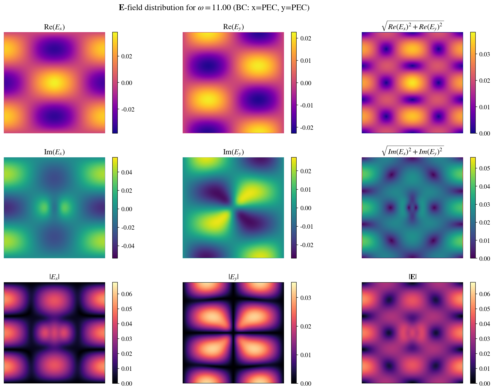
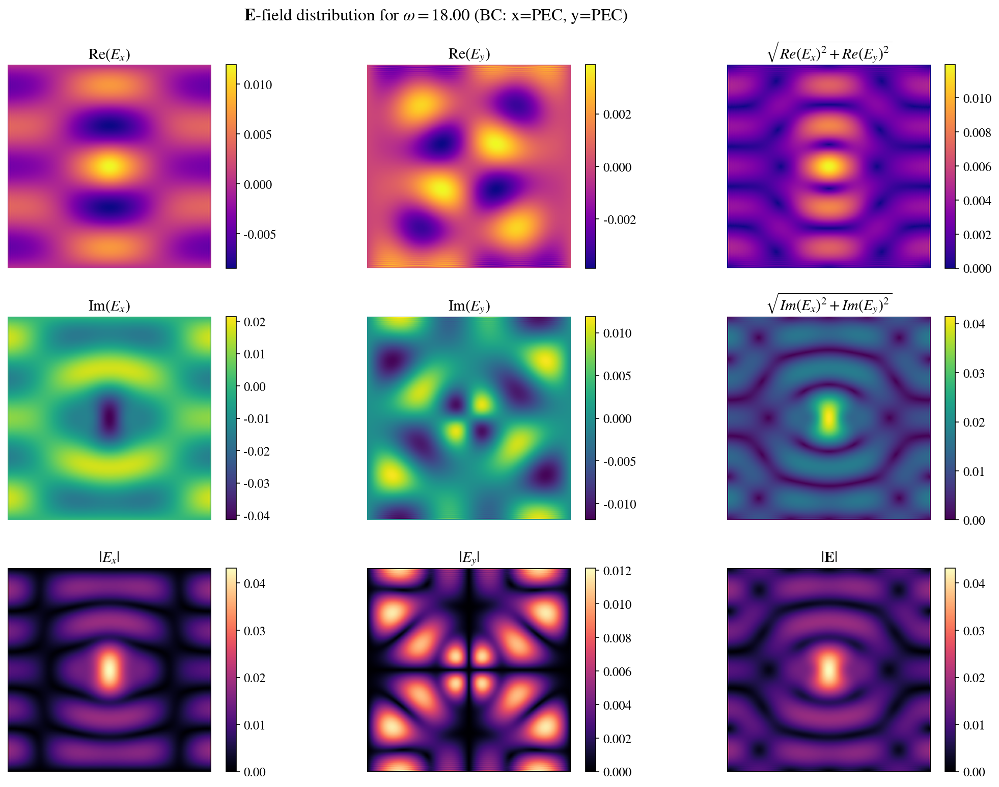
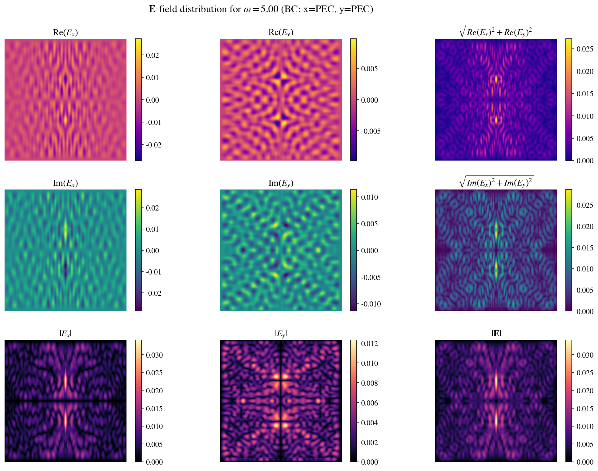
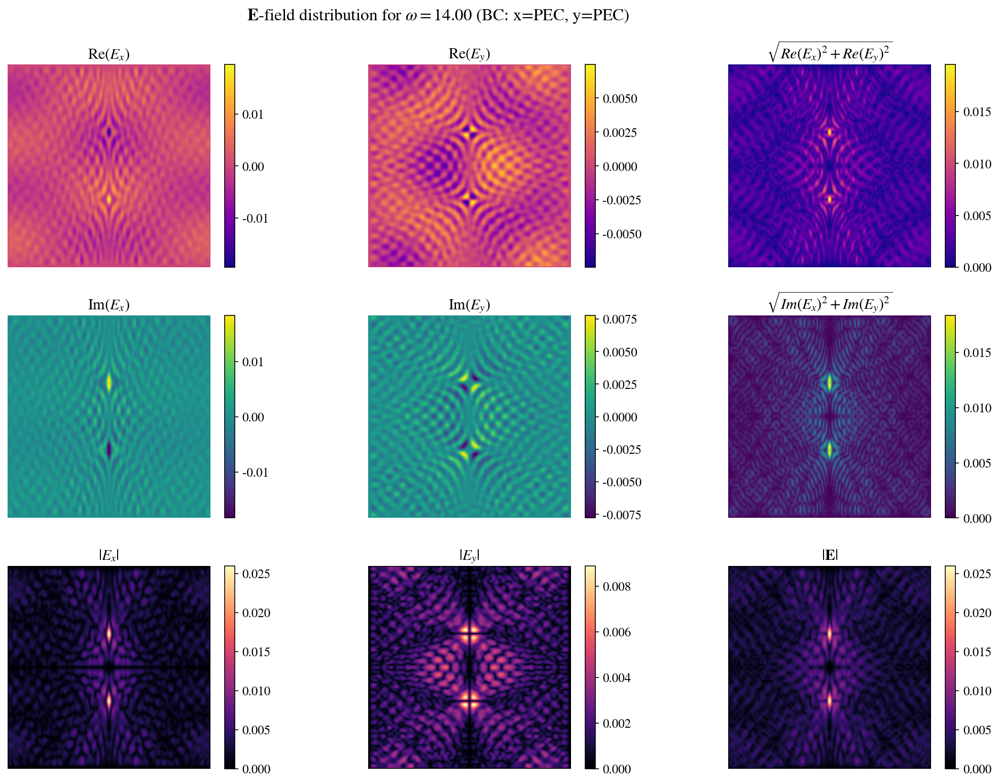

# AD vs. FD Jacobian-Free Newton-Krylov (JFNK) Solver

An optimized solver for nonlinear PDEs using the **Jacobian-Free Newton-Krylov (JFNK)** method. The Jacobian-vector products required at each inner linear iteration are computed via **Automatic Differentiation (AD)** from JAX and **Finite Differences (FD)**. The solver is applied to Burgers' equation and time-harmonic Maxwell equations in Kerr media.

---

## The JFNK Method

At each solver step (time $t$ for Burgers', frequency $\omega$ for Maxwell), the discretized PDE produces a nonlinear system of the form:

$$\mathbf{F}(\mathbf{x}) = 0$$

### 1. Newton's Method (Outer Loop)

The Newton linearization reads:

$$\mathbf{J}(\mathbf{x}^k) \  \delta \mathbf{x} = -\mathbf{F}(\mathbf{x}^k), \qquad \mathbf{x}^{k+1} = \mathbf{x}^k + \alpha \  \delta \mathbf{x}$$

where $\mathbf{J} = \partial \mathbf{F} / \partial \mathbf{x}$ is the Jacobian and $\alpha \in (0, 1]$ is a step length determined by backtracking line search. The problem converges when $\|\mathbf{F}(\mathbf{x}^k)\| \leq \tau_{\epsilon}$, where $\tau_\epsilon$ is the Newton tolerance, which can be defined and depends on the precision used, or if the Newton solver has reached a maximum number of iterations.

### 2. GMRES (Inner Loop)

The Newton linear system is solved iteratively using **GMRES** without ever forming $\mathbf{J}$ explicitly. GMRES only requires matrix-vector products of the form $\mathbf{J} \cdot \mathbf{p}$ per Krylov iteration, which is the key to the Jacobian-free approach. This is because the Krylov subspace constructed in solving the linear system $\mathbf{J} \delta \mathbf{x} = -\mathbf{F}$, with the residual $\mathbf{r}_0 = -\mathbf{F}(\mathbf{x}^k)$:

$$
\mathcal{K} ( \mathbf{J}, \mathbf{r}_0) = \text{span}  \left[ \mathbf{r}_0, \mathbf{J}\mathbf{r}_0, \mathbf{J}^2\mathbf{r}_0, \dots \right]
$$

At every iteration of the outer loop, GMRES iterates internally to find the vector $\mathbf{p}$ that best minimizes $\lVert \mathbf{J}\ \delta \mathbf{x} + \mathbf{F} \rVert_2$ so the actual Jacobian is not needed explicitly — only the product. When GMRES converges, it outputs $\delta \mathbf{x}$ (is that correct?).

### 3. Jacobian-Vector Products: AD vs. FD

There are two strategies to compute $\mathbf{J}(\mathbf{x}) \cdot \mathbf{p}$ in the GMRES solver:

**Finite Differences (Gateaux Derivative):**

$$\mathbf{J}(\mathbf{x}) \cdot \mathbf{p} \approx \frac{\mathbf{F}(\mathbf{x} + \varepsilon \mathbf{p}) - \mathbf{F}(\mathbf{x})}{\varepsilon}$$

The perturbation size $\varepsilon$ is chosen adaptively (but still quite arbitrarily) as:

$$\varepsilon = \sqrt{\varepsilon_{\text{mach}}} \cdot \max(1, \|\mathbf{x}\|)$$

clipped to $[\sqrt{\varepsilon_{\text{mach}}},\ \varepsilon_{\text{mach}}^{1/4}]$ to balance truncation and round-off error. It is important to remember that this is an approximation, and its accuracy depends critically on $\varepsilon$, which is again quite arbitrary.

**Automatic Differentiation (Forward-Mode JVP):**

$$\mathbf{J}(\mathbf{x}) \cdot \mathbf{p} = \frac{d}{d\varepsilon}\mathbf{F}(\mathbf{x} + \varepsilon\mathbf{p})\bigg|_{\varepsilon=0}$$

computed exactly (up to floating-point arithmetic) via `jax.jvp`. This is the directional derivative of $\mathbf{F}$ evaluated without any finite difference approximation. To do so, JAX creates a graph of our algorithm and evaluates the derivative up to machine precision by applying the chain rule.

### 4. Backtracking Line Search

After each GMRES solve, the step $\delta\mathbf{x}$ is accepted only if a sufficient decrease condition is met:

$$\|\mathbf{F}(\mathbf{x}^k + \alpha \  \delta\mathbf{x})\| < \|\mathbf{F}(\mathbf{x}^k)\|$$

Otherwise $\alpha \leftarrow \alpha/2$, up to a maximum number of halvings. This stabilizes convergence for highly nonlinear problems (e.g., shock formation in Burgers', near-resonance behavior in Maxwell's). This helps significantly, as sometimes it is necessary to tweak the tolerance to make the problem converge — the Newton loop can occasionally get stuck, or the error can begin to diverge at some point within it.

---

## CPU vs. GPU Backends

For both PDE systems, two backends are provided for testing:

| Backend | GMRES Solver | JVP Data Transfers |
|---------|-------------|----------------|
| **CPU** | SciPy `gmres` |  JAX → NumPy : `np.asarray(jax_result)` |
| **GPU** | CuPy `gmres` | JAX ↔ CuPy : no data copy with `DLPack` zero-copy  |

The GPU version uses `jax.dlpack` and `cupy.from_dlpack` to pass tensors between JAX and CuPy without leaving device memory, keeping the entire Newton-Krylov loop on the GPU. This allows for some optimization to avoid memory bottlenecks and more fairly evaluate the performance of the two methods. DLpack is an open standard for sharing tensors between different frameworks without copying the data, usually used in DeepLearning.

---

## I. Burgers' Equation

$$\frac{\partial \mathcal{U}}{\partial t} + (\mathcal{U} \cdot \nabla)\mathcal{U} = \nu \nabla^2 \mathcal{U}$$

where $\mathcal{U} = (u, v)$ is the 2D velocity field and $\nu$ is the kinematic viscosity.

### Discretization and Residual

Using a first-order implicit Euler time discretization, the nonlinear residual at Newton iteration $k$ for each velocity component is:

$$\mathbf{F}^u(\mathbf{u}^k, \mathbf{v}^k) = \mathbf{u}^k - \mathbf{u}^{n} + \Delta t \left[ \mathbf{A}(\mathbf{u}^k, \mathbf{v}^k) - \nu \  \mathbf{L}(\mathbf{u}^k) \right]$$

$$\mathbf{F}^v(\mathbf{u}^k, \mathbf{v}^k) = \mathbf{v}^k - \mathbf{v}^{n} + \Delta t \left[ \mathbf{A}(\mathbf{v}^k, \mathbf{u}^k) - \nu \  \mathbf{L}(\mathbf{v}^k) \right]$$

where $\mathbf{A}$ is the second-order central difference advection operator and $\mathbf{L}$ is the second-order central difference Laplacian. The full state vector $\mathbf{x}^k = (\mathbf{u}^k, \mathbf{v}^k)^T \in \mathbb{R}^{2N_x N_y}$ and $\mathbf{F} = (\mathbf{F}^u, \mathbf{F}^v)^T$.

The time step $\Delta t$ is selected adaptively via a CFL condition:

$$\Delta t = C \cdot \min\left(\frac{\Delta x}{\max|u|},\ \frac{\Delta y}{\max|v|},\ \frac{1}{2\nu(1/\Delta x^2 + 1/\Delta y^2)}\right)$$

**Boundary Conditions:** Dirichlet (zero-velocity walls) or periodic, configurable independently in $x$ and $y$.

**Features:**
- JIT-compiled JAX spatial operators with BC flags baked in at compile time.
- GMRES solved by SciPy (CPU) or CuPy (GPU).
- Backtracking line search to stabilize shock formation.
- u-field GIF output and kinetic energy plot ($E(t) = \frac{1}{2}\iint (u^2 + v^2) \  dx \  dy$).

---

### a. Taylor-Green Vortex (TGV)

 
<em>Fig. 1: Taylor-Green Vortex evolution over time.</em>

**Initial Conditions:**

$$u(x, y) = \sin(x)\cos(y), \qquad v(x, y) = -\cos(x)\sin(y)$$

The TGV is a classical benchmark for viscous flow solvers.

**Energy Dissipation:**

 
<em>Fig. 2: Kinetic energy exponential decay for the Taylor-Green Vortex.</em>

---

### b. Double Shear Layer (DSL)

 
<em>Fig. 3: Double Shear Layer evolution over time.</em>

**Initial Conditions:** Given steepness parameter $\rho = 30$ and perturbation amplitude $\delta = 0.05$:

$$u(x, y) = \begin{cases} \tanh\!\left(\rho \left(y - \dfrac{\pi}{2}\right)\right) & y \leq \pi \\\ \tanh\!\left(\rho \left(\dfrac{3\pi}{2} - y\right)\right) & y > \pi \end{cases}, \qquad v(x, y) = \delta \sin(x)$$

The DSL features two thin shear interfaces that are Kelvin-Helmholtz unstable, making it the most numerically challenging case for the nonlinear solver. The sinusoidal perturbation on $v$ triggers the instability, leading to vortical structures. This is a stress test for the nonlinear solver, as near-singular gradient regions form rapidly.

**Energy Dissipation:**

 
<em>Fig. 4: Kinetic energy decay for the Double Shear Layer.</em>

---

### c. 4-Vortex Collision (4VC)

 
<em>Fig. 5: 4-Vortex Collision evolution over time.</em>

**Initial Conditions:** A superposition of four Gaussian vortices with radius $R = 0.5$, centers $C_i = (c_{x,i}, c_{y,i})$, and circulation strengths $\Gamma_i$:

| Vortex | Center | $\Gamma$ |
|--------|--------|----------|
| $C_1$ | $(\pi - 0.8,\ \pi - 0.8)$ | $+1$ |
| $C_2$ | $(\pi + 0.8,\ \pi + 0.8)$ | $+1$ |
| $C_3$ | $(\pi - 0.8,\ \pi + 0.8)$ | $-1$ |
| $C_4$ | $(\pi + 0.8,\ \pi - 0.8)$ | $-1$ |

With $r_i^2 = (x - c_{x,i})^2 + (y - c_{y,i})^2$:

$$u(x, y) = \sum_{i=1}^{4} -\Gamma_i \ (y - c_{y,i})\  e^{-r_i^2 / R^2}, \qquad v(x, y) = \sum_{i=1}^{4} \Gamma_i \ (x - c_{x,i})\  e^{-r_i^2 / R^2}$$

The alternating-sign vortices induce mutual attraction and repulsion, producing a highly nonlinear collision event. This case exercises the backtracking line search most aggressively.

**Energy Dissipation:**

 
<em>Fig. 6: Kinetic energy decay for the 4-Vortex Collision.</em>

---

## II. Time-Harmonic Maxwell's Equations in Nonlinear Media

$$\nabla \times \nabla \times \mathbf{E} - \omega^2 \mu_0 \ \varepsilon(\mathbf{E})\  \mathbf{E} = i\omega\mu_0 \mathbf{J}$$

In the 2D **TE (Transverse Electric)** case, $\mathbf{E} = (E_x, E_y, 0)$, leading to a 2-component complex vector system. The **nonlinear permittivity** is a Kerr-type model with complex loss:

$$\varepsilon(\mathbf{E}) = \varepsilon_0 (1 - 0.05i)\left(1 + \chi \sqrt{|E_x|^2 + |E_y|^2}\right), \qquad \chi = 0.05$$

### Discretization and Residual

After expanding the curl-curl operator in 2D TE, the residual equations for the two field components are:

$$F_x = \partial_y(\partial_x E_y - \partial_y E_x) - \omega^2 \mu_0 \ \varepsilon(|\mathbf{E}|^2)\  E_x - i\omega\mu_0 J_x$$

$$F_y = -\partial_x(\partial_x E_y - \partial_y E_x) - \omega^2 \mu_0 \ \varepsilon(|\mathbf{E}|^2)\  E_y - i\omega\mu_0 J_y$$

All spatial derivatives are approximated with second-order central differences. The full state vector is $\mathbf{x} = (E_x^{\text{flat}}, E_y^{\text{flat}})^T \in \mathbb{C}^{2N_x N_y}$, and the residual is $\mathbf{F} = (F_x^{\text{flat}}, F_y^{\text{flat}})^T \in \mathbb{C}^{2N_x N_y}$.

**Boundary Conditions:** Perfect Electric Conductor (PEC) on all four walls. This is enforced by substituting boundary rows of the residual with $F = E_{\text{tangential}}$.

### Outer Loop: Frequency Sweep

Unlike Burgers', the Maxwell solver does not march in time. Instead, the JFNK system is solved independently at each frequency $\omega$ in a sweep $[\omega_{\min}, \omega_{\max}]$. Resonances appear as peaks in $\max|\mathbf{E}|(\omega)$, which are shifted with respect to the analytical vacuum cavity resonance frequencies:

$$\omega_{mn} = \pi\sqrt{m^2 + n^2}, \qquad m, n \in \mathbb{Z}^+$$

### Born Approximation for Initial Guess

At each frequency, the Newton iteration is initialized from the solution of the **linearized** (Born) problem, i.e. the residual evaluated at $\mathbf{x} = 0$ (which makes $\varepsilon$ constant) is used as a linear system and solved with a single GMRES pass. This reduces the number of Newton iterations needed, since Newton solvers perform well when initialized close to the solution. In Burgers', the small time-stepping ensures we remain somewhat close to the previous solution, achieving convergence very quickly. In Maxwell, we solve the problem based on sources and boundary conditions, making convergence harder. Starting with a simple linearized problem, solved directly by GMRES, can improve convergence by providing an initial guess that is reasonably close to the solution.

### Preconditioner

At each Newton step, a **block-diagonal complex-shifted Laplacian preconditioner (CSLP)** is built. Each $2\times 2$ diagonal block couples $(E_x, E_y)$ at a single grid point through the cross-derivative term $\partial_x\partial_y$. At each grid point $i$, the block is:

$$\mathbf{M}_i = \begin{pmatrix} \dfrac{2}{\Delta y^2} - \omega^2\mu_0\\tilde{\varepsilon}_i & \dfrac{1}{4\Delta x \Delta y} \\\ \dfrac{1}{4\Delta x \Delta y} & \dfrac{2}{\Delta x^2} - \omega^2\mu_0\ \tilde{\varepsilon}_i \end{pmatrix}$$

where the complex-shifted permittivity is $\tilde{\varepsilon}_i = \varepsilon(\mathbf{E}^k_i)\ (1 - 0.5i)$, evaluated at the current Newton iterate. This improves GMRES convergence near resonances where the unshifted operator is nearly singular, as it moves the spectrum away from the real axis.

Each block is inverted analytically as $\mathbf{M}_i^{-1} = \frac{\text{adj}(\mathbf{M}_i)}{\text{det}(\mathbf{M}_i)}$. On the boundary conditions, this simply becomes the identity to enforce the PEC. The full preconditioner is $\mathbf{M} = \text{blkdiag}(\mathbf{M}_1^{-1}, \ldots, \mathbf{M}_N^{-1})$, applied as a right preconditioner so GMRES solves $\mathbf{J}\mathbf{M}^{-1}\mathbf{y} = -\mathbf{F}$.

**Key Features:**
- Complex arithmetic, as `float32` and `float64` are mapped to (`complex64` / `complex128`).
- Frequency response plot with analytical PEC cavity resonances overlaid.
- Field output (Re, Im, Abs for both $E_x$ and $E_y$ plus $|\mathbf{E}|$) saved at configurable frequency intervals.

---

### a. Gaussian Source

**Source Definition:**

$$J_x(x,y) = \exp\!\left(-\frac{(x-x_0)^2 + (y-y_0)^2}{2\sigma^2}\right), \qquad J_y = 0$$

with $x_0 = y_0 = L/2$ (domain center) and $\sigma = 0.05 \cdot L$. A tightly focused Gaussian current source placed at the center of the domain. It excites all cavity modes symmetrically, making it well-suited for revealing the full resonance spectrum.

 
<em>Fig. 7–8: Field distribution (Re, Im, Abs) of E-field components for the Gaussian source at two different frequencies.</em>

---

### b. Dipole Source

**Source Definition:**

$$J_x(x,y) = G_1(x,y) - G_2(x,y), \qquad J_y = 0$$

where $G_i = \exp\!\left(-\frac{(x-x_0)^2 + (y-y_i)^2}{2\sigma^2}\right)$ with $y_1 = L/3$, $y_2 = 2L/3$, and $\sigma = 2\Delta x$. Two Gaussian lobes of opposite sign, separated along $y$, mimicking a classical dipole antenna. The antisymmetric source selectively excites modes with odd symmetry in the $y$-direction and suppresses even ones, making the resonance spectrum sparser and the near-field structure richer.

 
<em>Fig. 9–10: Field distribution (Re, Im, Abs) of E-field components for the Dipole source at two different frequencies.</em>

---

## Summary of Benchmark Cases

| PDE | Simulation Case | Origin of Nonlinearity | 
|-----|------|-------------|
| Burgers' | Taylor-Green Vortex (**TGV**) | Advection | 
| Burgers' | Double Shear Layer (**DSL**) | Advection + shear | 
| Burgers' | Four Vortex Collision (**4VC**)| Advection + collision | 
| Maxwell | **Gaussian** Current Distribution| Kerr permittivity | 
| Maxwell | **Dipole** Current Distribution | Kerr permittivity | 
