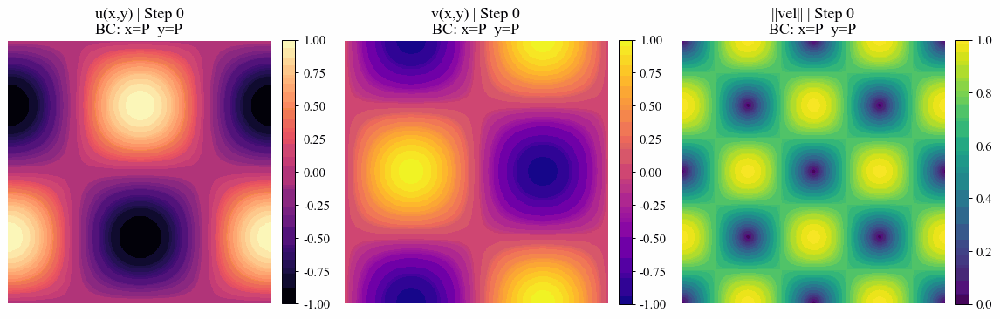

# 2D Burgers' Equation: AD vs. FD JFNK Solver
A optimized, fully implicit solver for the 2D Burgers' equation using a Jacobian-Free Newton-Krylov (JFNK) method. This script benchmarks Automatic Differentiation (AD) from JAX against Finite Differences (FD) for Jacobian-vector products.

$$
\frac{\partial \textbf{u} }{\partial t} + ( \textbf{u} \cdot \nabla ) \textbf{u} = \nu \nabla^2 \textbf{u}
$$

**Key Features:**
* Combines JIT-compiled JAX math with SciPy's native GMRES.
* Includes Backtracking Line Search to stabilize highly non-linear shocks.
* Test cases: Taylor-Green Vortex (TGV), Double Shear Layer (DSL), 4-Vortex Collision (4VC).

# Taylor-Green Vortex (TGV)

# Double Shear Layer (DSL)

# 4-Vortex Collision (4VC)

